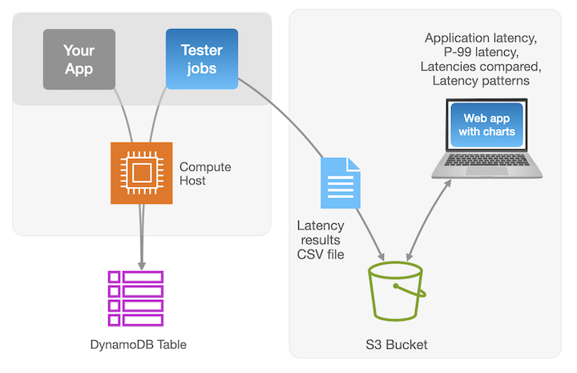

# Setup

[HOME](../README.md) - **Setup** - [Jobs](../jobs/README.md) - [Charts](../app/README.md)


## Solution components
There are three main components of this solution:
 * **setup**: New table definitions and setup scripts
 * **jobs**: Multi-step job definitions that save request latency details to S3
 * **app**: A custom Next.JS web app that renders charts of experiment results



It's recommended to deploy and run the job system within AWS on an EC2 host. When jobs are run in AWS in the same region as the DynamoDB table, the lowest latencies will be seen.

It's also recommended to deploy the App onto your laptop, so that you will have easy and personal access to browse job results using the chart dashboard. 

# Jobs Setup

### Pre-requisites
* A bash environment such as an EC2 host or laptop terminal
* AWS CLI, configured with IAM access to DynamoDB, S3, Cloudwatch, and STS
* Node.JS 

### Environment setup
1. Verify your environment can access AWS
```
aws sts get-caller-identity
```

1. Clone this repository

 ```
 git clone https://github.com/awslabs/amazon-dynamodb-tools.git
 ```

1. Install Node.JS dependencies
   
   ```
   cd amazon-dynamodb-tools/tester
   npm install
   ```

1. Locate and run the setup script which will create an S3 bucket and four DynamoDB tables. You may adjust the region name as needed.
   
```
   export AWS_REGION=us-east-1
   cd setup
   chmod +x ./setup.sh
   ./setup.sh
```
   
   The new S3 bucket's name is stored in the file: ```/config.json```
   
   Each DynamoDB table has a key schema of PK and SK, and is in On Demand capacity mode. The final two tables are Global Tables.

   * mytable
   * everysize
   * MREC
   * MRSC

The server-side component of tester is now set. Let's switch gears and deploy the client App component on your laptop. This webapp will serve the charts dashboard showing the latency of the test executions.

# App Setup
### Pre-requisites

* Node.JS v18 or higher
* AWS CLI, configured with IAM access to S3 

1. From your laptop, open a terminal (command) prompt, and clone the project repository again. 

 ```
 git clone https://github.com/awslabs/amazon-dynamodb-tools.git
 ```
   
1.  Next, install the required dependency modules (these listed in the *package.json* file).
```
cd amazon-dynamodb-tools/tester
npm install
```
   
1. Launch the web app. This will run a custom [Next.js](https://nextjs.org/) app from your laptop. 
   
```
cd app
npm run dev
```

1. Open a browser and navigate to http://localhost:3000

You should see a web app in your browser called **tester** that is configured to point to the same Jobs S3 bucket.

**tester** is now ready for action! 

Next, you will run [Jobs](../jobs/README.md)
